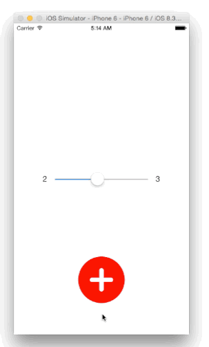
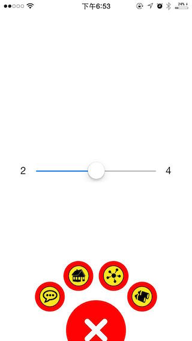

<p align="left" >
  
</p>


带粘性的扇形菜单

Path menu with gooey effectes.


灵感来自[这个Dribbble设计](https://dribbble.com/shots/1936758-GIF-of-the-Tap-Bar-Concept):

Inspired by this dribbble:


###下面是实现的效果：
###Here is what the repo can do:

**1、点击每个具体的菜单可以获得相应的编号，使用时，可以switch这个序号进行想要的后续操作。**

1.Tap each menu,you will get the number in the protocol method,so you can switch-case the number to do the later work.

**2、可自定义菜单个数。**

2.You can customize the number of the menu.

**3、可自定义父菜单和子菜单间距。**

3.You can customize the distance between super menu and the sub menus.

**4、自定义颜色。**

4.Customize the theme color.

**5、自定义菜单图标。**

4.Customize menu icon.





also,you can set the menu's icon:





##Installation

`pod 'KYGooeyMenu', '~> 1.0.5'`


##Usage
###Initialize
```objective-c
    gooeyMenu = [[KYGooeyMenu alloc]initWithOrigin:CGPointMake(CGRectGetMidX(self.view.frame)-50, 500) andDiameter:100.0f andDelegate:self themeColor:[UIColor redColor]];
    gooeyMenu.menuDelegate = self;
    gooeyMenu.radius = 100/4;     //这里把小圆半径设为大圆的1/4
    gooeyMenu.extraDistance = 20; //间距设为R+r+20。注：R+r是默认存在的。
    gooeyMenu.MenuCount = 4;      //4个子菜单
    gooeyMenu.menuImagesArray = [NSMutableArray arrayWithObjects:
        [UIImage imageNamed:@"tabbarItem_discover highlighted"],
        [UIImage imageNamed:@"tabbarItem_group highlighted"],
        [UIImage imageNamed:@"tabbarItem_home highlighted"],
        [UIImage imageNamed:@"tabbarItem_message highlighted"],
        [UIImage imageNamed:@"tabbarItem_user_man_highlighted"], nil];

```

###implement protocol method
```objective-c
-(void)menuDidSelected:(int)index{
    NSLog(@"选中第%d",index);
}

```

##*That's it!*    *Enjoy!*


##版本
##Version
###v2.0.0 
  This version is under tesing.So if you download this repo,you will see the test version(not finished) default.If you want to check the former version,just open the version1 code in the project.

###v1.0.5 

 增加自定义背景图。Add custom meun icon.
 
###v1.0.4
  隐藏Menu时，背后的子菜单也会消失。When you hide the menu,the sub-menu in the back will also hide.
  

##License
This project is under MIT License. See LICENSE file for more information.
